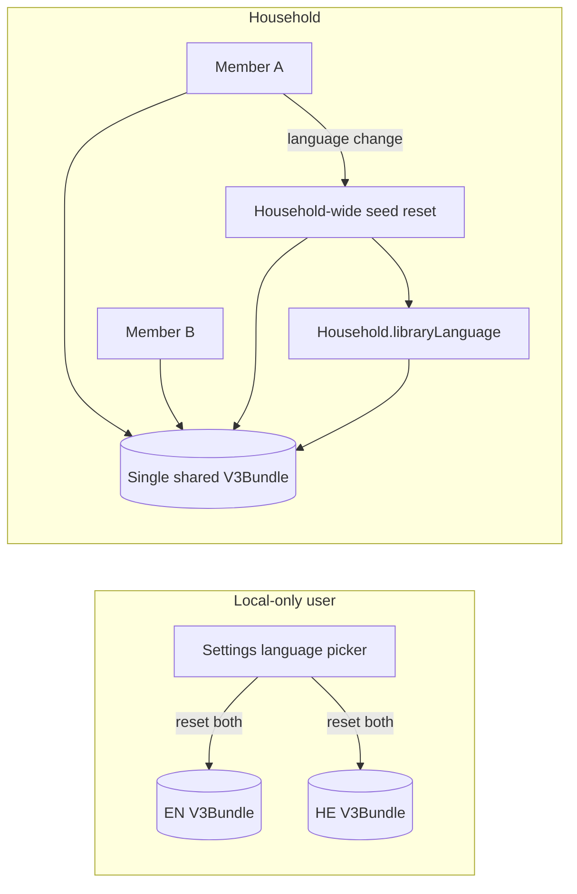
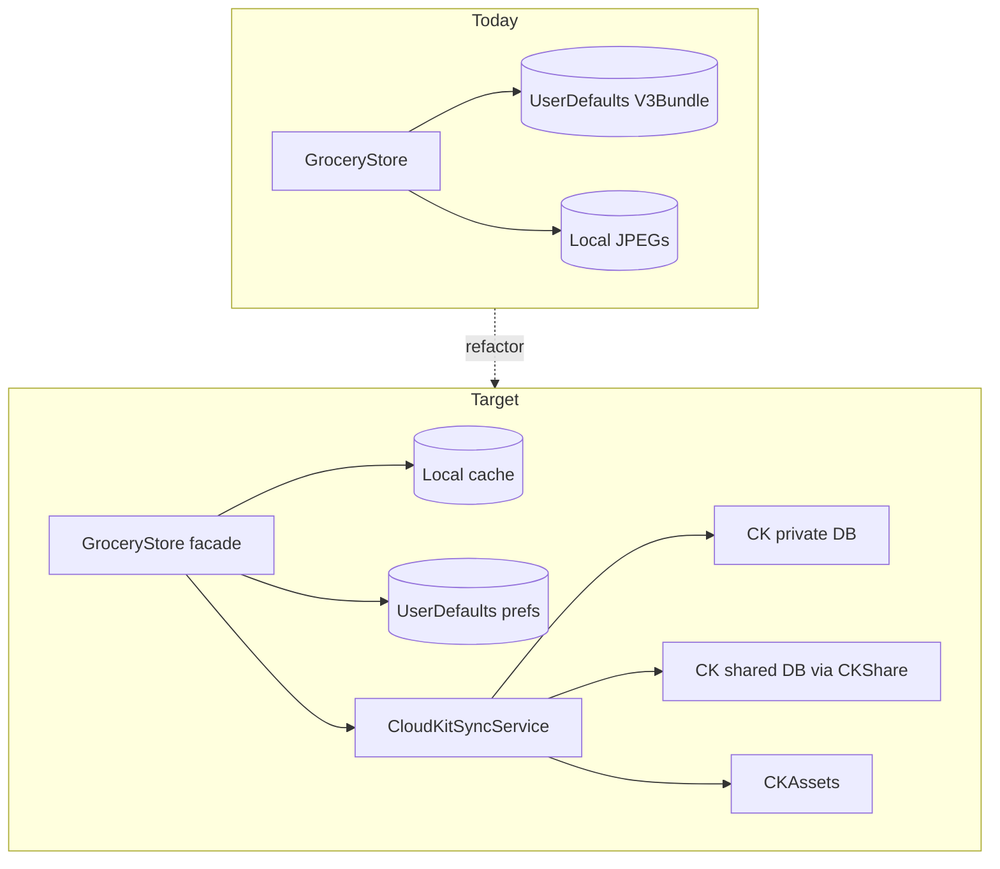
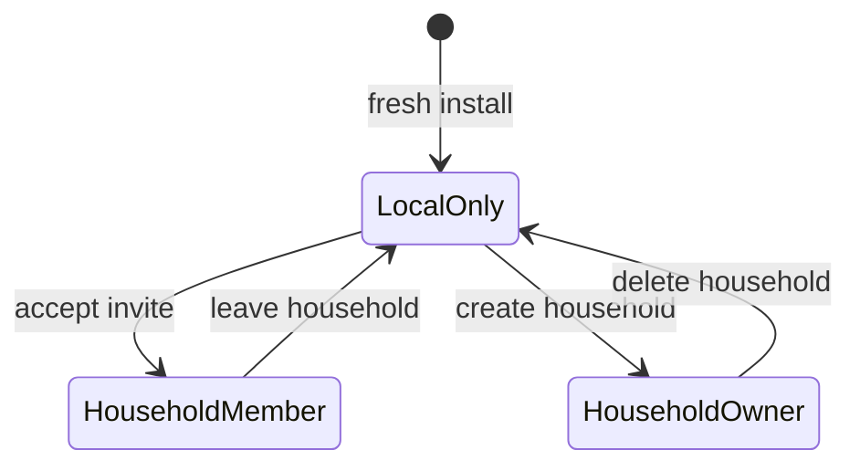

# CloudKit multi-user shared household

> Saved from implementation plan — June 2026.
>
> **Scope:** Shared home library + shopping list for multiple users in one household via CloudKit + CKShare.
> **Status:** Plan only — Phase 1 implementation was reverted; see phases below when resuming.

---

## Product decisions (confirmed)

- **Local-only remains the default.** Sharing requires iCloud; users without iCloud keep today's fully offline experience.
- **One active household per user.** Simplifies CKShare ownership, Settings UX, and App Group snapshot scope.
- **Single library language per household.** All members share one catalog + shopping list in one language (English or Hebrew). There is no parallel EN/HE bundle in the cloud for the same household.
- **Household language change = household-wide reset.** If any household member changes library language in Settings, it triggers the same destructive reset as today (`resetLibraryToInitialSeed()` — wipe catalog, tags, shopping, recipes, images; reseed defaults) and updates `Household.libraryLanguage` for **all members** via sync. Reuse the existing confirmation alert pattern in Settings, with copy updated to warn that the reset affects the whole household.

### Local-only vs household language model

| Mode | Library data |
|------|----------------|
| **Local-only** (no household) | Keep today's dual-bundle model (`grocery.v3.english` / `grocery.v3.hebrew` in UserDefaults). Language switch resets both sides locally — unchanged. |
| **Household member** | Single shared `V3Bundle` in CloudKit keyed by `householdID`. Member's `app.catalogContentLanguage` must match `Household.libraryLanguage`. No per-member language-specific catalog. |



## Current state (at time of plan)

Shoplister v2 is **100% local**:

- `GroceryStore.swift` owns all mutations and persists two `V3Bundle` JSON blobs to `UserDefaults` (`grocery.v3.english` / `grocery.v3.hebrew`)
- Item photos are local JPEGs via `ItemImageStore.swift`
- Share extension + App Intent use App Group IPC only (`ShareExtensionAppGroupSupport.swift`)
- Entitlements: App Group only (`GroceryList.entitlements`) — **no CloudKit**



---

## Architecture

### Layered storage

Refactor `GroceryStore` from "store + persistence" into a **facade** over three layers:

| Layer | Responsibility | Technology |
|-------|----------------|------------|
| **UI facade** | `@Published` arrays, existing mutation API | `GroceryStore` (slimmed) |
| **Local cache** | Optimistic reads/writes, offline queue, migration source | SwiftData (recommended on iOS 26) or SQLite |
| **Cloud sync** | CK record CRUD, subscriptions, share lifecycle | New `CloudKitSyncService` + `HouseholdRepository` |

UI mutations write to local cache **immediately** (snappy UX), enqueue sync ops, and apply remote deltas via CK push + foreground fetch.

### CloudKit topology

| Database | Contents |
|----------|----------|
| **Private** | User profile pointer, active `householdID`, pending invites metadata, sync cursor tokens |
| **Shared (CKShare)** | Household root + all domain records for the active household |

**CKShare root record:** `Household` — participants get read/write on child records (items, tags, shopping entries, recipes).

**Container:** `iCloud.com.ianengelman.grocerylist.v2` (new capability in Xcode + CloudKit Dashboard schema).

### CloudKit record types

```
Household          — id, name, libraryLanguage (english|hebrew), createdAt, ownerRecordName, shareReference
GroceryItem        — id, householdID, name, inventoryTagID, shoppingTagID, sortOrder, hasImage, modifiedAt, modifiedBy, isDeleted
Tag                — id, householdID, kind, title, sortOrder, modifiedAt, isDeleted
ShoppingEntry      — id, householdID, itemID, quantity, isChecked, addedAt, modifiedAt, isDeleted
Recipe             — id, householdID, name, sortOrder, lines (JSON or child records), modifiedAt, isDeleted
ItemImage          — itemID, householdID, asset (CKAsset), thumbnailAsset (optional)
```

No `language` field on domain records — language is a **household-level property** on `Household.libraryLanguage`. Indexes on `householdID` only.

Use **tombstones** (`isDeleted`) rather than hard deletes for sync propagation.

### Conflict rules (v1)

| Action | Rule |
|--------|------|
| Shopping qty / checked | Field-level last-write-wins using `modifiedAt` |
| Duplicate add-to-shopping | Merge into one line, sum quantities |
| Catalog name / tag edit | Last-write-wins |
| Catalog delete with shopping refs | Tombstone item; remove shopping lines |
| Reorder | Higher `modifiedAt` on `sortOrder` wins |
| **Library language change** | Household-wide reset: tombstone/delete all domain records, reseed from `BilingualSeedCatalog` for new language, update `Household.libraryLanguage`, sync to all members |
| Offline concurrent edits | Replay local op queue on reconnect |

Avoid CRDTs until real-world conflict pain appears.

---

## User-facing flows

### Settings: new "Household" section

| State | UI |
|-------|-----|
| Local-only (default) | "Share with household" → explains iCloud requirement → Create household |
| Household owner | Household name, members list, Invite (share link), Leave / Delete household |
| Household member | Household name, members, Leave |
| iCloud unavailable | Banner: sharing disabled; app works locally |
| Sync error | Retry + last-updated timestamp |

### Library language (Settings)

| Mode | Behavior |
|------|----------|
| Local-only | Unchanged: picker shows EN/HE; confirm → `resetLibraryToInitialSeed()` locally |
| Household member | Picker shows EN/HE; confirm → household-wide reset + `libraryLanguage` update pushed to CloudKit; all members receive reset on next sync. Alert copy must state this affects **everyone in the household**. Members cannot maintain a personal alternate-language catalog while in a household. |

When a member's device language preference drifts from `Household.libraryLanguage` (e.g. after join), reconcile on launch: adopt household language and refresh local cache from cloud.

### First-run / upgrade migration

When user taps **Create household from this library**:

1. Offer backup export (`CatalogBackupCodec`) as safety net
2. Set `Household.libraryLanguage` to the user's **current active** catalog language
3. Upload that language's `V3Bundle` + images to new shared zone (do not upload the inactive language bundle)
4. Mark local data as bound to `householdID`
5. Enable sync going forward

When user **Accepts invite** (`CKShare.Metadata`):

1. Do not silently wipe local catalog — prompt: Replace with household data / Keep local (stay local-only) / Export first
2. Set active `householdID` in private DB
3. Set `catalogLanguageRaw` to household's `libraryLanguage`
4. Fetch shared records into local cache (single bundle)

### Modes



Local-only users: no CloudKit writes, no behavior change from today.

---

## Phased implementation

### Phase 1 — Foundation (single-user iCloud sync, no invites)

**Goal:** Prove migration off UserDefaults + image sync across a user's own devices.

- Add CloudKit + Push entitlements to main app
- Define CK schema in CloudKit Dashboard (Development)
- Introduce SwiftData local cache mirroring `V3Bundle` entities
- Build `CloudKitSyncService`: upload/download **one active `V3Bundle`** per user/household in **private DB** (Phase 1 mirrors solo user's active language only; inactive local bundle stays device-local until household)
- Migrate `grocery.v3.*` UserDefaults → cache on first launch; keep UserDefaults as fallback until stable
- `ItemImageStore` → local cache + `CKAsset` upload/download pipeline
- Slim `GroceryStore`: mutations → cache → sync queue
- Settings: iCloud status indicator, manual "Sync now", error state
- Unit tests: round-trip encode/decode, offline queue replay, image asset pipeline

**Exit criteria:** Edit shopping list on iPhone A, see update on iPhone B (same Apple ID) within ~30s.

### Phase 2 — Household + CKShare

**Goal:** Multi-user shared catalog + shopping list.

- Add `Household` root record with `libraryLanguage` + `CKShare` creation in private DB
- Move single-language domain records from private DB → shared DB zone on household creation
- `HouseholdRepository`: create, invite (`UICloudSharingController`), accept, leave, delete, transfer ownership
- Handle share acceptance in `GroceryListApp.swift` via `CKShare.Metadata` / `userDidAcceptCloudKitShareWith`
- CK subscriptions on `ShoppingEntry` + `GroceryItem` for push-driven updates
- Settings Household UI (confirmed: one active household)
- Enforce: sharing requires iCloud; local-only users unaffected

**Exit criteria:** Two different Apple IDs in same household see shared shopping list updates in near-real-time.

### Phase 3 — Extension + polish

- Host app refreshes App Group catalog snapshot from **active household cache** (single language, stable item IDs)
- Share extension + `ImportTextToShoppingListIntent` enqueue ops; host merges to cloud
- Offline UX: "Changes will sync when online"
- Migration wizard polish, conflict toasts for rare failures
- CloudKit Dashboard → Production schema deploy
- Privacy nutrition label updates (data linked to user, shared with household members)

### Phase 4 — Deferred

- Activity feed ("Ian checked off Milk")
- Custom backend for Android/web
- Per-member read-only roles

---

## Key code changes

| File / area | Change |
|-------------|--------|
| `GroceryStore.swift` | Facade over cache + sync; `resetHouseholdLibraryToSeed(newLanguage:)` for household-wide language reset; keep `resetLibraryToInitialSeed()` for local-only |
| **New** `LocalDataStore` (SwiftData) | Persistent cache, migration from UserDefaults |
| **New** `CloudKitSyncService` | Record mapping, fetch/changedTokens, push handling, retry |
| **New** `HouseholdRepository` | CKShare lifecycle, membership |
| **New** `SyncMetadata` on models | `modifiedAt`, `modifiedBy`, `isDeleted`, `householdID` (no per-record language) |
| `ItemImageStore.swift` | Local file cache + CKAsset coordinator |
| `GroceryListApp.swift` | iCloud account observer, sync bootstrap, share accept |
| `SettingsView.swift` | Household section, iCloud status; household-aware language picker with whole-household reset |
| `ShareExtensionAppGroupSupport.swift` | Household-aware snapshot with stable IDs |
| `GroceryList.entitlements` | CloudKit + Push Notifications |
| `CatalogBackupCodec.swift` | Keep as manual export escape hatch; import must not regenerate UUIDs when household-bound |

---

## Entitlements and Apple setup

Main app (extension stays App Group only for v1; host syncs snapshot):

```
com.apple.developer.icloud-services → CloudKit
com.apple.developer.icloud-container-identifiers → iCloud.com.ianengelman.grocerylist.v2
aps-environment → development/production
```

CloudKit Dashboard: create record types, indexes on `householdID`, deploy Development → Production before App Store release.

No Sign in with Apple required (iCloud account suffices).

---

## Risks and mitigations

| Risk | Mitigation |
|------|------------|
| Data loss on migration | Export prompt + dual-write UserDefaults during Phase 1 beta |
| `GroceryStore` is 1400+ lines touching every feature | Phase 1 extracts repository first; keep public API stable |
| Shopping list conflicts in real households | Field-level LWW + merge duplicate lines; log anomalies |
| CKAsset quotas / image bandwidth | Compress JPEGs, optional thumbnail record, lazy download |
| Share extension cannot sync CK | Host maintains App Group snapshot; extension enqueues only |
| Household language change by one member | Destructive for all — strong confirmation UI; sync reset atomically via Household record + bulk tombstone/reseed |
| Accidental household-wide reset | Same mitigation as today's language alert; consider owner-only language change if user feedback demands it (not v1 default) |

**Effort:** Large feature — Phase 1 alone is multi-week; full shared household (Phases 1–3) is multi-month.

---

## Recommended starting point

Begin with **Phase 1** only: CloudKit private-DB sync of the user's **active** `V3Bundle` for a single iCloud user across their own devices. That validates the hardest engineering (leaving UserDefaults, sync engine, image assets) before CKShare membership complexity.

Update `docs/MultiUserSharingPlan.md` bilingual section to match single-language household model when implementation starts.

---

## Implementation checklist

- [ ] Confirm household bilingual model (single `libraryLanguage` per household)
- [ ] Phase 1: CloudKit container, local cache, migrate V3Bundle off UserDefaults, single-user multi-device sync
- [ ] Add CKAsset pipeline for ItemImageStore with local cache
- [ ] Extract sync engine from GroceryStore; define conflict rules and mutation queue
- [ ] Phase 2: Household model, CKShare invites, membership UI in Settings
- [ ] Phase 2: Household-wide library language change with destructive reset synced to all members
- [ ] Update share extension App Group snapshot to household-aware stable IDs
- [ ] Build first-run migration: create household from local data vs join existing
