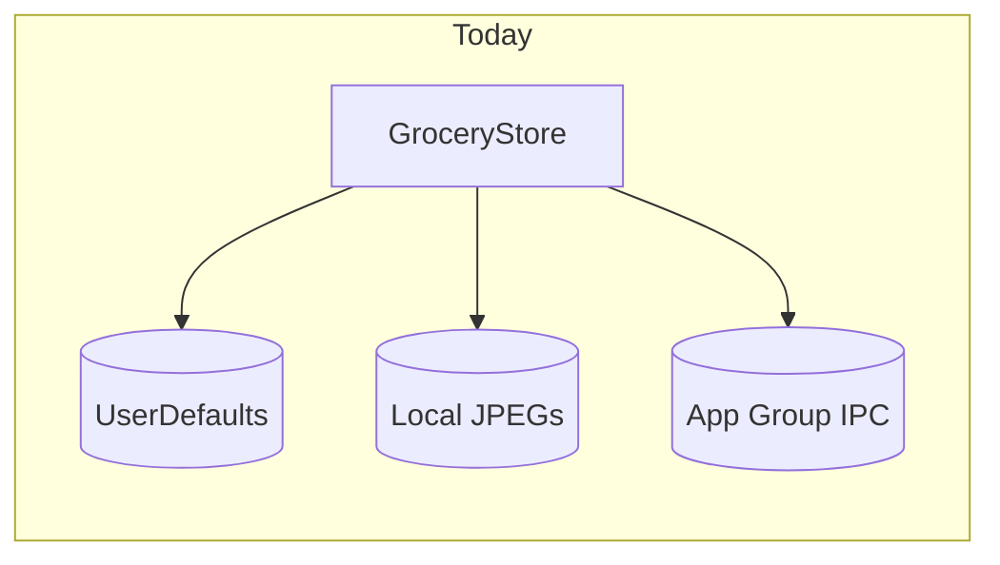
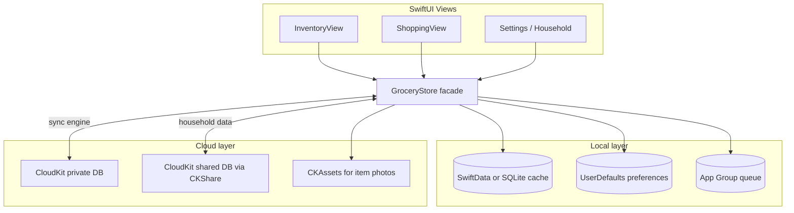

# Multi-user shared household plan

> Reference document for future implementation. Saved June 2026.
>
> **Scope:** Shared home library + shopping list for multiple users in one household.
> **Recommended path:** CloudKit + CKShare (no custom backend for v1).

---

## Where the app is today

Shoplister v2 is **fully local**: [`GroceryStore.swift`](../Source/Services/GroceryStore.swift) persists two independent language bundles (`english` / `hebrew`) to `UserDefaults`, each containing catalog, tags, and shopping list. There is **no user identity, no cloud sync, and no shared list ID**.



Existing “sharing” is **export-only**:
- Shopping list → plain text via [`ShoppingListShareText.swift`](../Source/Features/Shopping/ShoppingListShareText.swift)
- Catalog backup → manual `.txt` import/export via [`CatalogBackupCodec.swift`](../Source/Services/CatalogBackupCodec.swift)
- Share extension → name-matched add-to-shopping on **same device** via [`ShareExtensionAppGroupSupport.swift`](../Source/Services/ShareExtensionAppGroupSupport.swift)

None of this supports live collaboration between users.

---

## What you are building

A **shared household** model where multiple people see and edit the **same home library and shopping list**.

That implies new concepts the app does not have today:

| Concept | Purpose |
|---------|---------|
| **Household / shared space** | Stable ID for one shared catalog + shopping list |
| **Membership** | Who can read/write; owner vs member |
| **Invite / join flow** | Add spouse/roommate without manual backup exchange |
| **Cloud persistence** | Source of truth beyond one device |
| **Conflict resolution** | Two people checking off or editing qty at once |
| **Image sync** | `ItemImageStore` JPEGs must move to shared storage |
| **Offline + merge** | App must work in store with no signal, then reconcile |

---

## Recommended path: CloudKit first

For an **iOS-only, no-backend** app, **CloudKit + `CKShare`** is the best starting point.

### Why CloudKit fits
- Native invite UI (`UICloudSharingController`)
- Private + shared databases map cleanly to “my account” vs “household”
- No server ops, auth largely handled by iCloud
- Push-driven updates via CK subscriptions
- Fits Apple ecosystem household use case

### When you would need a custom backend instead
- Android / web clients
- Email/password or non-Apple sign-in
- Admin dashboards, audit logs, billing
- Complex permissions (read-only members, per-aisle roles)
- Heavy real-time presence (“who is typing”)

**Pragmatic recommendation:** prototype household sharing on CloudKit. If you later need cross-platform, add a backend that mirrors the same domain model rather than bolting sync onto UserDefaults indefinitely.

### CloudKit vs backend (summary)

| | CloudKit + CKShare | Firebase / Supabase |
|--|-------------------|---------------------|
| Time to first shared list | Lower | Higher |
| Running cost | Low (Apple infra) | Low–medium |
| Invite UX | Apple-native share sheet | Custom link + auth |
| Offline | Good with local cache | Good with local cache |
| Cross-platform | No | Yes |
| Image storage | `CKAsset` | Storage bucket |
| Your control over conflicts | Moderate | Full |

---

## Architecture target

Refactor from “one local bundle” to **layered storage**:



### Key structural change
[`GroceryStore`](../Source/Services/GroceryStore.swift) today **is** persistence. It should become a **facade over a sync engine** that:
1. Reads/writes optimistic local cache immediately (UI stays snappy)
2. Pushes mutations to CloudKit
3. Applies remote changes via subscriptions / fetch
4. Resolves conflicts with explicit rules

---

## Data model changes

### 1. Introduce household scope

Today’s `V3Bundle` is a good inner shape, but it needs a parent:

```swift
// New domain types (illustrative)
struct Household {
    var id: UUID
    var name: String
    var createdAt: Date
    var ownerUserRecordName: String
}

struct HouseholdBundle {
    var catalog: [GroceryItem]
    var inventoryTags: [Tag]
    var shoppingTags: [Tag]
    var shopping: [ShoppingEntry]
    var contentLanguage: AppContentLanguage // see bilingual note below
    var revision: Int // or change-token for conflicts
}
```

CloudKit record types would mirror these: `Household`, `GroceryItem`, `Tag`, `ShoppingEntry`, plus metadata fields (`modifiedAt`, `modifiedBy`, `isDeleted`).

### 2. Bilingual model decision (important)

Today English and Hebrew are **two fully separate datasets** in one app install. For a shared household you must pick one:

- **Option A (recommended): one shared catalog per household per language** — household “Engelman” has EN bundle + HE bundle in cloud; members choose UI language locally.
- **Option B: one language per household** — simpler, but awkward for bilingual families.
- **Option C: merge languages into one canonical catalog** — largest migration; probably not worth it.

Plan around **Option A** to preserve current product behavior.

### 3. Stable IDs become critical

[`CatalogBackupCodec`](../Source/Services/CatalogBackupCodec.swift) currently assigns **new UUIDs on import**. Shared collaboration requires **stable `GroceryItem.id` across all members**. Share extension matching should move from name-based to **ID-based** where possible, with name fallback for text imports.

### 4. Images

[`ItemImageStore.swift`](../Source/Models/ItemImageStore.swift) stores JPEGs locally. Shared households need:
- Upload on add/replace photo
- Download on first display / background prefetch
- Delete propagation when item removed
- Size limits and thumbnail strategy (CloudKit asset quotas)

### 5. Personal vs shared (optional but useful)

Even with “shared household” as goal, consider keeping a **personal local list** for users who join a household but still want a private scratch list. Not required for v1, but affects Settings UX early.

---

## Sync and conflict rules

You need explicit product rules before engineering:

| Action | Suggested v1 rule |
|--------|-------------------|
| Two users add same item to shopping | Merge into one unchecked line, sum quantities |
| One checks off, one increments qty | Last-write-wins per field, or split checked/unchecked rows as today |
| Edit item name / group | Last-write-wins with `modifiedAt` |
| Delete catalog item with active shopping refs | Tombstone item; remove or orphan shopping lines with UI warning |
| Reorder within group | Higher `sortOrder` revision wins, or CRDT later |
| Offline edits on two devices | Queue local ops; replay on reconnect; surface rare conflicts in Settings |

Start with **field-level last-write-wins + tombstones**. Avoid custom CRDTs until real conflict pain appears.

---

## User-facing flows to add

### Household management (new Settings area)
- Create household
- Rename household
- Invite member (CloudKit share link)
- Accept invite
- Leave household
- Transfer ownership
- Show members + sync status (“Last updated 2m ago”, error retry)

### First-run / migration
- Existing local data → “Create household from this library” or “Join existing household”
- Joining should **not** silently wipe local catalog; offer merge preview or export backup first

### Shopping + Home UX changes
- Subtle shared indicator (household name, member avatars optional)
- Optional “sync pending” state for offline edits
- Conflict toast only for unresolvable cases

### Share extension impact
[`ShareExtension`](../ShareExtension/ShareImportFlow.swift) must read from **shared household cache**, not only host snapshot in App Group. The extension cannot easily run full CloudKit sync; typical pattern:
- Host app keeps App Group snapshot **in sync with active household**
- Extension enqueues ops; host merges to cloud

---

## Code areas that would change

| Area | Change |
|------|--------|
| [`GroceryStore.swift`](../Source/Services/GroceryStore.swift) | Split persistence from mutation; add household context; emit sync ops |
| New `CloudKitSyncService` / `HouseholdRepository` | CK records, shares, subscriptions, retry |
| Models [`GroceryItem`](../Source/Models/GroceryItem.swift), [`ShoppingEntry`](../Source/Models/ShoppingEntry.swift), [`Tag`](../Source/Models/Tag.swift) | Sync metadata, CK mapping |
| [`ItemImageStore.swift`](../Source/Models/ItemImageStore.swift) | Local cache + cloud asset pipeline |
| [`GroceryListApp.swift`](../Source/GroceryListApp.swift) | iCloud account check, sync bootstrap, share accept handlers |
| Entitlements | Add CloudKit container + push |
| Settings | Household UI, sign-in status, leave/join |
| Share extension + App Group | Household-aware snapshot + IDs |
| [`CatalogBackupCodec.swift`](../Source/Services/CatalogBackupCodec.swift) | Keep for backup/export; not primary sync |
| Tests | Sync merge cases, offline queue, invite acceptance |

---

## Entitlements and Apple setup

Add to main app + extension as needed:
- `com.apple.developer.icloud-services` → CloudKit
- CloudKit container (e.g. `iCloud.com.ianengelman.grocerylist.v2`)
- Push Notifications capability (for silent CK updates)
- Possibly **Sign in with Apple** only if you later add a backend; **not required** for CloudKit (uses iCloud account)

App Store / privacy updates:
- Privacy nutrition labels: data linked to user / shared with other users
- Account deletion policy if you add backend accounts later

---

## Phased rollout (recommended)

### Phase 1 — Foundation (no invites yet)
- Add CloudKit container + local cache (SwiftData or SQLite)
- Mirror current `V3Bundle` into cloud for **single-user iCloud backup/sync across own devices**
- Migrate UserDefaults → cache on upgrade
- Prove image upload/download

### Phase 2 — Household + invites
- `CKShare` on household root record
- Create/join/leave UI
- Membership-aware reads/writes in shared DB
- CK subscriptions for live shopping updates

### Phase 3 — Polish + extension
- Household-aware share extension snapshot
- Offline queue UX, error recovery
- Migration wizard for existing users
- Conflict logging / support tooling

### Phase 4 — Only if needed
- Backend for non-Apple clients or advanced permissions
- Activity feed (“Ian checked off Milk”)

---

## Effort and risk snapshot

| Workstream | Relative effort | Risk |
|------------|-----------------|------|
| CloudKit schema + sync engine | High | Highest — touches every mutation path |
| Household invite UX | Medium | Medium — Apple APIs help |
| Migration from UserDefaults | Medium | Data loss if rushed |
| Image sync | Medium | Storage limits, bandwidth |
| Bilingual household model | Medium | Product ambiguity |
| Share extension updates | Low–medium | Extension lifecycle constraints |
| Conflict handling | Medium | UX surprises in real households |
| Backend alternative | Very high | Ongoing ops + auth |

**Rough order of magnitude:** meaningful v1 shared household (CloudKit, 2–5 members, library + shopping, images) is a **large feature** — think multi-week to multi-month depending on polish, not a small Settings toggle.

---

## Biggest product decisions to settle before coding

1. **One household per user or many?** (Most apps: one active household, optional leave/create new.)
2. **What happens to solo users without iCloud?** Read-only? Local-only mode? Require iCloud for sharing?
3. **Checked items:** shared in real time for all members, or personal view preference only?
4. **Deleting the household:** who can do it, and what happens to members’ local caches?
5. **Language switching:** does switching catalog language switch which household bundle you edit, or only UI strings?

---

## Suggested next step

If you want to move forward, the lowest-risk proof is **Phase 1**: CloudKit sync of today’s `V3Bundle` for a **single iCloud user across their own devices**, without invites. That validates the hardest part (moving off UserDefaults + image sync) before adding `CKShare` membership complexity.

---

## Implementation checklist

- [ ] Confirm household bilingual model (recommend: one shared EN + HE bundle per household)
- [ ] Phase 1: CloudKit container, local cache, migrate V3Bundle off UserDefaults, single-user multi-device sync
- [ ] Add CKAsset pipeline for ItemImageStore with local cache
- [ ] Extract sync engine from GroceryStore; define conflict rules and mutation queue
- [ ] Phase 2: Household model, CKShare invites, membership UI in Settings
- [ ] Update share extension App Group snapshot to household-aware stable IDs
- [ ] Build first-run migration: create household from local data vs join existing
